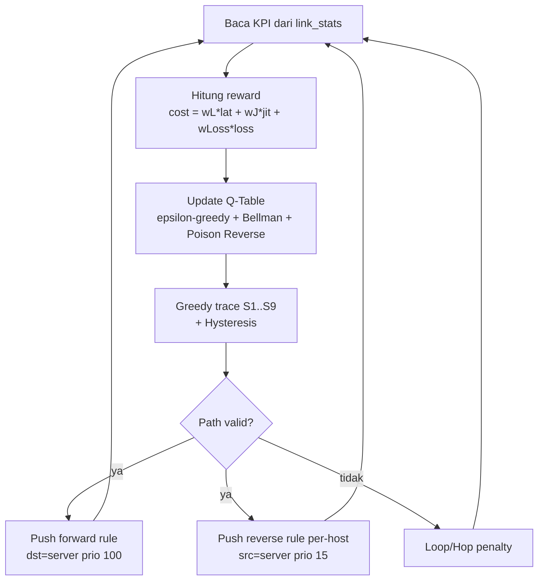

# Diagram Alur Sistem SDN — Q-Learning Adaptive Routing

Dokumen ini menggambarkan alur data dan kontrol antar tiga komponen:

- **Mininet**  : `perc_ta_mn_final_03_hostmonitoring_02.py` (data plane)
- **Agen KPI** : `agent_reporter_04_kpi_aktual.py` (telemetri)
- **Ryu**      : `perc_ta_ryu_final_06_optimasirute.py` (control plane)

Komunikasi antar komponen **tidak melalui API langsung**, melainkan lewat
**file JSON di `/tmp` sebagai message bus**.

---

## 1. Diagram Arsitektur (Komponen & Message Bus)

```
                         FILESYSTEM /tmp  (MESSAGE BUS)
        ┌───────────────────────────────────────────────────────────────┐
        │                                                                 │
        │   host_topology.json          link_report_<src>_<dst>.json      │
        │   (peta host user)            (KPI per-link, ~20 file)          │
        │                                                                 │
        └─────▲───────────────┬──────────────▲──────────────┬────────────┘
              │ tulis (1x)     │ baca (1x)    │ tulis (loop)  │ baca (loop)
              │                │              │               │
   ┌──────────┴────────┐      │      ┌────────┴──────────┐    │
   │   MININET         │      │      │   AGEN KPI (HMx)  │    │
   │ (topologi+spawn)  │      │      │  ping → ukur KPI  │    │
   │                   │      │      │  (proses x~20)    │    │
   │  S1..S9 + Hx/HMx  │      │      └─────────┬─────────┘    │
   └─────────┬─────────┘      │                │ ping ICMP    │
             │ OpenFlow 1.3   │                │ (data plane) │
             │ (kanal kontrol)│                ▼              │
             │                │      ┌───────────────────────┐│
             │                └──────┤   RYU CONTROLLER      ││
             └───────────────────────┤  (otak Q-Learning)    ├┘
              packet-in / flow-mod   │                       │
                                     │  • baca KPI           │
                                     │  • Q-Learning update  │
                                     │  • push flow rule      │
                                     │  • Web API :8080       │
                                     └───────────────────────┘
```

**Kanal komunikasi:**
1. Mininet → Ryu : `host_topology.json` (lokasi server H9) + OpenFlow (packet-in).
2. Agen → Ryu    : `link_report_*.json` (KPI link, di-refresh tiap ~1.5 dtk).
3. Ryu → Switch  : OpenFlow `FlowMod` (install/hapus flow rule).
4. Agen → Switch : traffic ping ICMP melewati data plane (kena netem/kondisi link).

---

## 2. Diagram Bootstrapping (Urutan Startup)

```
MININET                AGEN KPI            FILESYSTEM           RYU CONTROLLER
   │                      │                    │                      │
   │ build topologi       │                    │                      │
   │ S1..S9, Hx, HMx      │                    │                      │
   │ static ARP           │                    │                      │
   ├─ tulis host_topology.json ───────────────►│                      │
   │                      │                    │                      │
   │ spawn ~20 agen ─────►│                    │                      │
   │                      │ ping HMx→HMy        │                      │
   │                      ├─ tulis link_report_*.json ──►│             │
   │                      │ (loop tiap ~1.5s)  │                      │
   │                      │                    │                      │
   │                      │                    │◄─ baca host_topology ─┤  _startup_logic:
   │                      │                    │   (server_dpid=S9)    │  tunggu file + parse
   │                      │                    │                      │
   │                      │                    │◄─ baca link_report ───┤  _monitor_reader_loop
   │                      │                    │                      │
   │◄═══ LLDP discovery (OpenFlow) ════════════════════════════════════┤  _topology_discovery
   │                      │                    │                      │  (tunggu 11 link)
   │                      │                    │                      │
   │                      │                    │                      │  WARMUP 10s
   │                      │                    │                      │  (Dijkstra dulu)
   │                      │                    │                      │
   │                      │                    │                      │  rl_ready = True ✅
   │                      │                    │                      │  Q-Learning aktif
```

**Gerbang kesiapan (`rl_ready`)** baru `True` setelah: file topologi terbaca,
KPI pertama masuk, warmup 10 detik selesai, dan LLDP mendekati 11 link.

---

## 3. Diagram Loop Runtime (Siklus Q-Learning tiap 2 detik)

```
   ┌─────────────────────── _rl_background_worker (tiap RL_INTERVAL=2s) ───────────────────────┐
   │                                                                                            │
   │  ┌──────────────┐   self.link_stats   ┌──────────────────┐                                 │
   │  │ link_report  │ ─────────────────►  │ 1. AMBIL KPI      │                                 │
   │  │  *.json      │  (_monitor_reader)  │   lat, jit, loss  │                                 │
   │  └──────────────┘                     └─────────┬─────────┘                                 │
   │                                                 │                                           │
   │                                                 ▼                                           │
   │                                       ┌───────────────────────┐                            │
   │                                       │ 2. HITUNG REWARD       │                            │
   │                                       │ cost = wL·lat+wJ·jit   │                            │
   │                                       │        +wLoss·loss     │                            │
   │                                       │ reward = -SCALE·cost   │                            │
   │                                       │          - HOP_PENALTY │                            │
   │                                       └─────────┬─────────────┘                            │
   │                                                 ▼                                           │
   │                                       ┌───────────────────────┐                            │
   │                                       │ 3. UPDATE Q-TABLE      │                            │
   │                                       │ ε-greedy pilih aksi    │                            │
   │                                       │ Bellman + Poison Rev   │                            │
   │                                       │ Loop/Hop penalty       │                            │
   │                                       └─────────┬─────────────┘                            │
   │                                                 ▼                                           │
   │                                       ┌───────────────────────┐                            │
   │                                       │ 4. GREEDY TRACE        │                            │
   │                                       │ S1→...→S9 (+Hysteresis)│                            │
   │                                       │ tentukan active path   │                            │
   │                                       └─────────┬─────────────┘                            │
   │                                                 ▼                                           │
   │                    ┌────────────────────────────┴───────────────────────────┐             │
   │                    ▼                                                          ▼             │
   │      ┌───────────────────────────┐                        ┌──────────────────────────────┐ │
   │      │ 5a. PUSH FORWARD RULE      │                        │ 5b. PUSH REVERSE RULE         │ │
   │      │ match: ipv4_dst=10.0.0.9   │                        │ match: ipv4_src=10.0.0.9,     │ │
   │      │ prio=100                   │                        │        ipv4_dst=host_ip        │ │
   │      │ (tiap switch di path)      │                        │ prio=15, idle=30 (per-host)    │ │
   │      └─────────────┬─────────────┘                        └────────────────┬───────────────┘ │
   │                    │                                                        │                 │
   └────────────────────┼────────────────────────────────────────────────────── ┼────────────────┘
                        ▼  OpenFlow FlowMod                                       ▼
                ┌──────────────────────────────── SWITCH S1..S9 ──────────────────────────┐
                │  forward (Hx→H9) & reverse (H9→Hx) flow rule terpasang di data plane     │
                └─────────────────────────────────────────────────────────────────────────┘
```

---

## 4. Diagram Forward vs Reverse Path (Kontribusi File _06)

```
   FORWARD  (Hx → H9)  dikontrol Q-LEARNING
   ───────────────────────────────────────────────────────────────►
   H8 ─► S8 ─► S6 ─► S4 ─► S1 ─► S2 ─► S5 ─► S7 ─► S9 ─► H9
         match: ipv4_dst=10.0.0.9   (priority 100)


   REVERSE  (H9 → Hx)  CERMIN dari forward (file _06)
   ◄───────────────────────────────────────────────────────────────
   H8 ◄─ S8 ◄─ S6 ◄─ S4 ◄─ S1 ◄─ S2 ◄─ S5 ◄─ S7 ◄─ S9 ◄─ H9
         match: ipv4_src=10.0.0.9, ipv4_dst=host_ip  (priority 15)
         TANPA in_port  → cocok seragam termasuk di S9
         idle_timeout=30 → rule orphan expired sendiri saat path berubah

   ┌─────────────────────────────────────────────────────────────┐
   │ MASALAH LAMA : reverse pakai Dijkstra → RTT = QL + Dijkstra   │
   │ SOLUSI _06   : trace forward QL, balik urutannya, push per    │
   │                host → RTT murni mencerminkan jalur Q-Learning │
   └─────────────────────────────────────────────────────────────┘
```

**Hierarki prioritas flow rule (FlowRuleManager):**

```
   prio 200  PRIO_SERVER_DIRECT   di S9: dst=server → port host server
   prio 100  PRIO_SERVER_FWD      forward QL ke server
   prio  15  PRIO_REVERSE_Q       reverse QL per-host (src=server)
   prio  10  PRIO_HOST_ROUTE      Dijkstra host-to-host (fallback/warmup)
   prio   0  PRIO_TABLE_MISS      kirim ke controller (packet-in)
```

---

## 5. Versi Mermaid (untuk render di laporan)

### 5.1 Arsitektur komponen

```mermaid
flowchart LR
    subgraph DP[Data Plane - Mininet]
        SW[Switch S1..S9]
        HX[Host user Hx]
        HM[Host monitor HMx]
    end

    subgraph SENSOR[Telemetri]
        AG[Agen KPI x~20]
    end

    subgraph BUS[/tmp message bus/]
        TOPO[(host_topology.json)]
        REP[(link_report_*.json)]
    end

    subgraph CP[Control Plane - Ryu]
        CTRL[TAMainController<br/>Q-Learning]
    end

    SW -- tulis 1x --> TOPO
    AG -- ping ICMP --> SW
    AG -- tulis loop --> REP
    TOPO -- baca --> CTRL
    REP -- baca --> CTRL
    CTRL -- FlowMod OpenFlow --> SW
    SW -- packet-in/LLDP --> CTRL
```

### 5.2 Loop runtime Q-Learning


