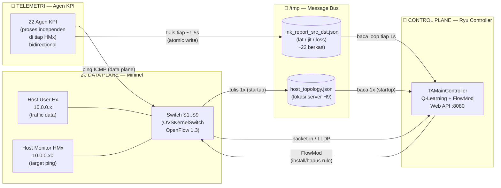
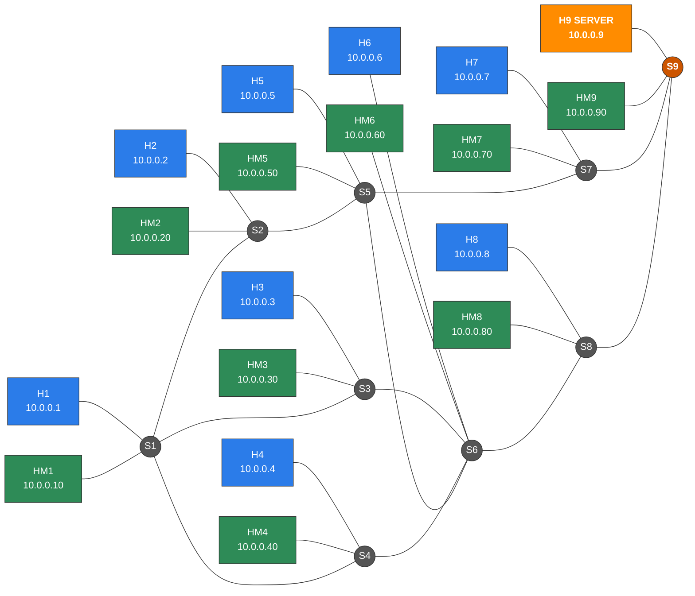
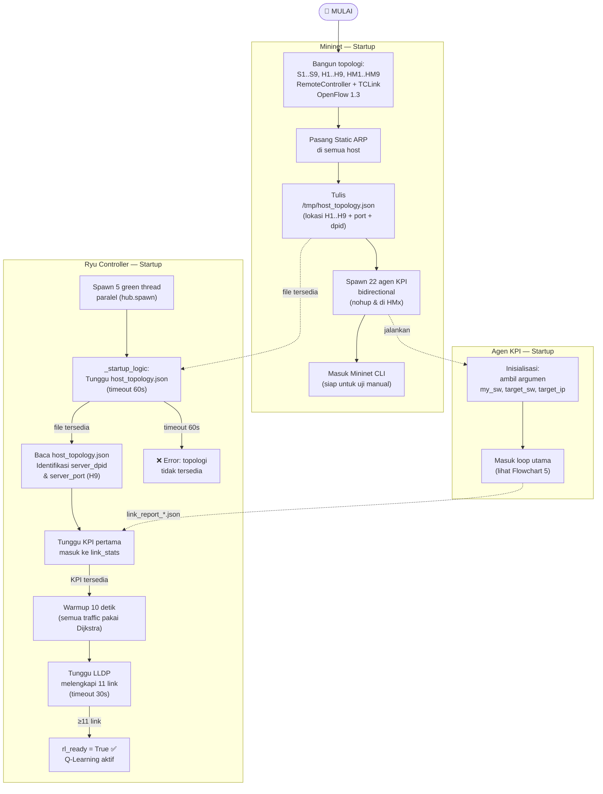
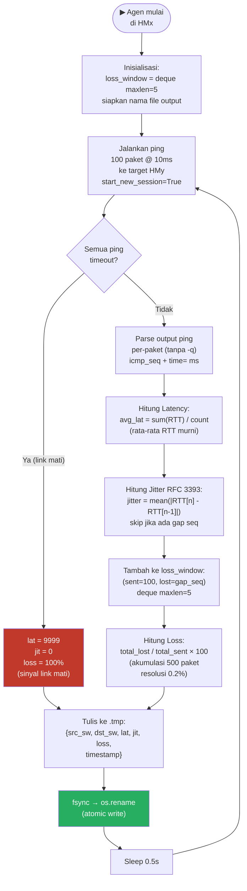
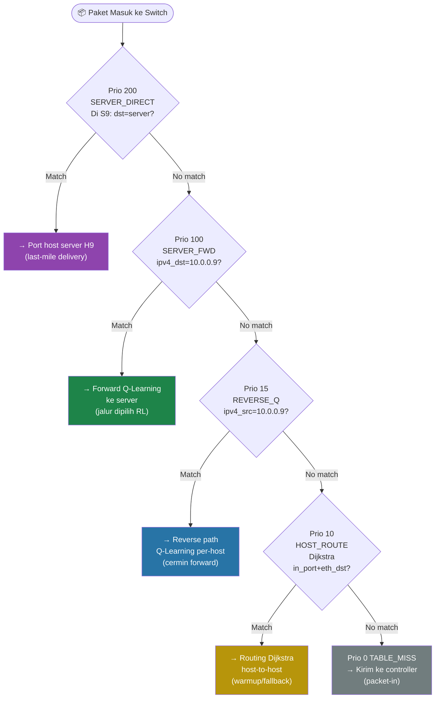
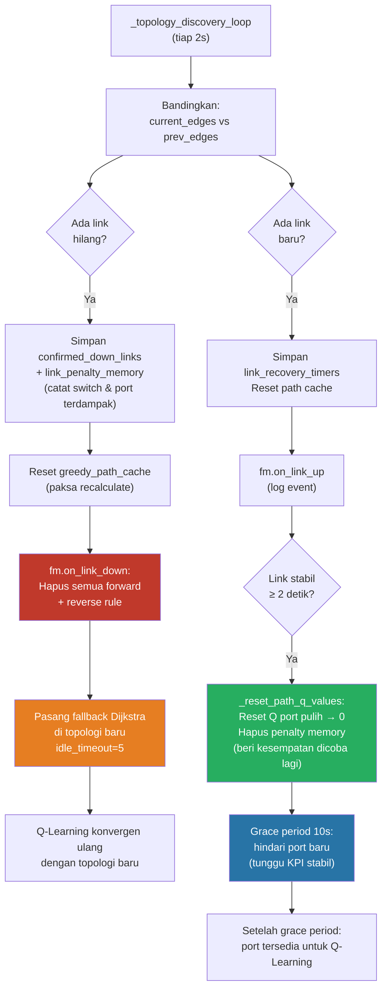
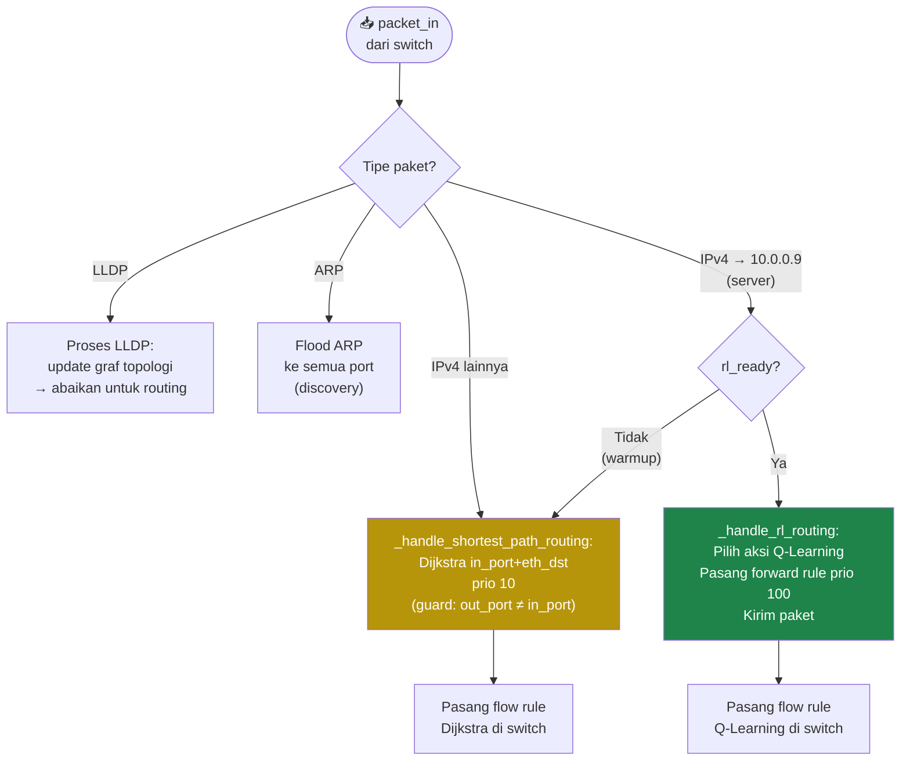
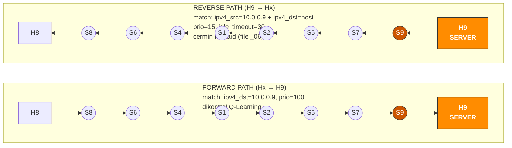
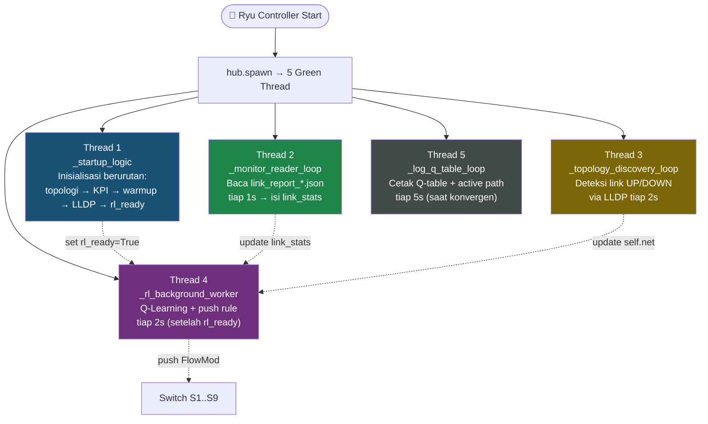
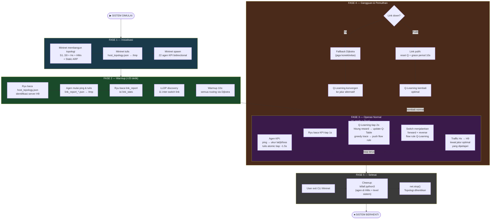

# Flowchart Sistem SDN — Q-Learning Adaptive Routing

Dokumen ini menyajikan flowchart lengkap sistem SDN berbasis Q-Learning yang mencakup
tiga komponen utama: **Mininet** (data plane), **Agen KPI** (telemetri), dan
**Ryu Controller** (control plane).

---

## 1. Flowchart Arsitektur Komponen Sistem



---

## 2. Flowchart Topologi Jaringan



---

## 3. Flowchart Proses Bootstrapping (Urutan Startup)



---

## 4. Flowchart Agen KPI — Loop Pengukuran



---

## 5. Flowchart Controller Ryu — Loop Runtime Q-Learning (tiap 2 detik)

```mermaid
flowchart TD
    RL_START([🔄 _rl_background_worker\ntiap RL_INTERVAL = 2s])

    RL_START --> RL_CHECK{rl_ready?}
    RL_CHECK -->|"Tidak"| RL_WAIT["Tunggu...\n(Dijkstra aktif)"]
    RL_WAIT --> RL_CHECK

    RL_CHECK -->|"Ya"| RL_KPI["① Ambil KPI dari link_stats\n{lat, jit, loss}\nper pasangan switch"]

    RL_KPI --> RL_STALE{Data stale?\nlat>1000 atau loss>20\ndan Q < -100}
    RL_STALE -->|"Ya"| RL_RESET_Q["Auto-reset Q ke 0\n(pulih dari data error)"]
    RL_STALE -->|"Tidak"| RL_REWARD

    RL_RESET_Q --> RL_REWARD

    RL_REWARD["② Hitung Reward:\ncost = W_LAT×lat + W_JIT×jit + W_LOSS×loss\n(W: 1, 5, 100)\nreward = -SCALE×cost - HOP_PENALTY\n(SCALE=10, HOP=5)"]

    RL_REWARD --> RL_UPDATE["③ Update Q-Table (Bellman):\nQ(s,a) ← Q(s,a) + α×[reward + γ×maxQ(s',a') - Q(s,a)]\nα=0.7, γ=0.9\n+ Poison Reverse (exclude port balik)\n+ Loop Penalty kumulatif (jika loop)"]

    RL_UPDATE --> RL_EPS["ε-greedy:\nε turun 1.0 → 0.05\n(eksplorasi → eksploitasi)"]

    RL_EPS --> RL_TRACE["④ Greedy Trace:\nS1 → ... → S9\npilih port Q-terbaik + Hysteresis (3.0)\n(tidak pindah jalur kecuali unggul ≥3.0)"]

    RL_TRACE --> RL_LOOP_CHECK{Path valid?\n(ada loop?)}
    RL_LOOP_CHECK -->|"Loop terdeteksi"| RL_LOOP_PEN["Tambah Loop Penalty +100\npada port bermasalah"]
    RL_LOOP_PEN --> RL_GC

    RL_LOOP_CHECK -->|"Valid"| RL_PUSH_FWD["⑤a Push FORWARD Rule\nmatch: ipv4_dst=10.0.0.9\nprio=100\n(tiap switch di active path)"]

    RL_PUSH_FWD --> RL_PUSH_REV["⑤b Push REVERSE Rule per-host\nbalik urutan forward path\nmatch: ipv4_src=server, ipv4_dst=host\nprio=15, idle_timeout=30\n(tanpa in_port)"]

    RL_PUSH_REV --> RL_CONV["Catat Convergence Timer\n(durasi rerouting jika path berubah)"]
    RL_CONV --> RL_GC["Garbage Collection:\nhapus Q-entry port tidak valid"]
    RL_GC --> RL_START

    style RL_REWARD fill:#1a5276,color:#fff
    style RL_UPDATE fill:#1a5276,color:#fff
    style RL_PUSH_FWD fill:#1e8449,color:#fff
    style RL_PUSH_REV fill:#1e8449,color:#fff
    style RL_LOOP_PEN fill:#c0392b,color:#fff
```

---

## 6. Flowchart Hierarki Prioritas Flow Rule



---

## 7. Flowchart Penanganan Dinamika Topologi (Link UP/DOWN)



---

## 8. Flowchart Penanganan Paket (Packet-In Handler)



---

## 9. Flowchart Forward vs Reverse Path (Simetri Q-Learning)



---

## 10. Flowchart Thread Paralel Controller



---

## 11. Flowchart Alur Sistem Keseluruhan (End-to-End)



---

## Ringkasan Komponen Flowchart

| # | Flowchart | Komponen |
|---|-----------|----------|
| 1 | Arsitektur Komponen & Message Bus | Sistem keseluruhan |
| 2 | Topologi Jaringan 9 Switch | Mininet |
| 3 | Proses Bootstrapping / Urutan Startup | Mininet + Agen + Ryu |
| 4 | Loop Pengukuran KPI | Agen KPI |
| 5 | Loop Runtime Q-Learning (tiap 2s) | Ryu Controller |
| 6 | Hierarki Prioritas Flow Rule | Ryu / FlowRuleManager |
| 7 | Penanganan Dinamika Topologi (Link UP/DOWN) | Ryu Controller |
| 8 | Penanganan Paket (Packet-In Handler) | Ryu Controller |
| 9 | Forward vs Reverse Path Simetris | Ryu Controller |
| 10 | Thread Paralel Controller | Ryu Controller |
| 11 | Alur Sistem Keseluruhan (End-to-End) | Sistem keseluruhan |
