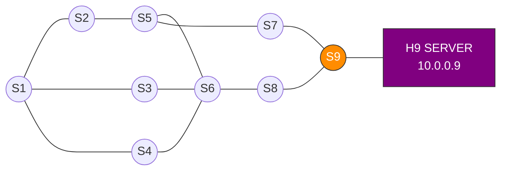
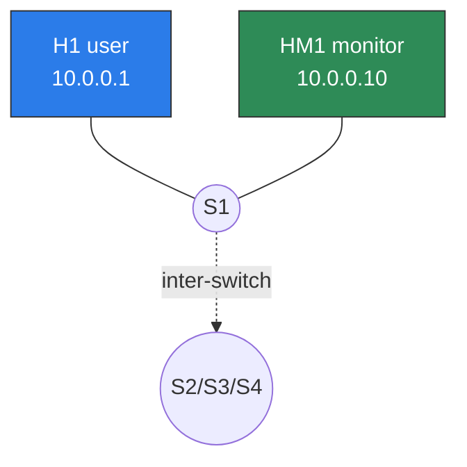

# BAB — PERANCANGAN SISTEM
## Sistem SDN dengan Routing Adaptif Berbasis Q-Learning

Dokumen ini merangkai keseluruhan perancangan sistem secara runut: dari
gambaran umum, arsitektur, perancangan tiap komponen (data plane, telemetri,
control plane), hingga alur kerja sistem. Disusun dari tiga berkas implementasi:

- **Data plane**  : `perc_ta_mn_final_03_hostmonitoring_02.py` (Mininet)
- **Telemetri**   : `agent_reporter_04_kpi_aktual.py` (Agen KPI)
- **Control plane**: `perc_ta_ryu_final_06_optimasirute.py` (Ryu)

---

## 1. Gambaran Umum Sistem

Sistem yang dirancang adalah jaringan **Software-Defined Networking (SDN)** yang
melakukan **routing adaptif** dari host mana pun menuju satu server tujuan
(H9, `10.0.0.9`). Pemilihan jalur tidak statis, melainkan **dipelajari secara
online** oleh agen *Q-Learning* di controller berdasarkan kualitas link aktual
(latency, jitter, packet loss) yang diukur terus-menerus.

Tiga komponen mengisi tiga lapisan yang terpisah tegas:

| Komponen | Peran | Lapisan |
|----------|-------|---------|
| Mininet | Membangun topologi fisik & menyalakan agen | Data plane |
| Agen KPI | Mengukur kualitas link via ping | Sensor/telemetri |
| Ryu | Otak: Q-Learning + instalasi flow rule | Control plane |

**Prinsip komunikasi:** ketiga komponen **tidak saling memanggil API secara
langsung**, melainkan bertukar data melalui **berkas JSON di `/tmp`** sebagai
*message bus*, ditambah kanal OpenFlow antara controller dan switch.

---

## 2. Arsitektur Sistem

```
                         FILESYSTEM /tmp  (MESSAGE BUS)
        ┌───────────────────────────────────────────────────────────────┐
        │   host_topology.json          link_report_<src>_<dst>.json      │
        │   (peta host user)            (KPI per-link, 22 berkas)         │
        └─────▲───────────────┬──────────────▲──────────────┬────────────┘
              │ tulis (1x)     │ baca (1x)    │ tulis (loop)  │ baca (loop)
   ┌──────────┴────────┐      │      ┌────────┴──────────┐    │
   │   MININET         │      │      │   AGEN KPI (HMx)  │    │
   │ (topologi+spawn)  │      │      │  ping → ukur KPI  │    │
   │  S1..S9 + Hx/HMx  │      │      │  (22 proses)      │    │
   └─────────┬─────────┘      │      └─────────┬─────────┘    │
             │ OpenFlow 1.3   │                │ ping ICMP    │
             │                │                ▼              │
             │                │      ┌───────────────────────┐│
             │                └──────┤   RYU CONTROLLER      ││
             └───────────────────────┤  Q-Learning + FlowMod ├┘
              packet-in / flow-mod   │  + Web API :8080      │
                                     └───────────────────────┘
```

**Empat kanal komunikasi:**
1. Mininet → Ryu : `host_topology.json` (lokasi server) + OpenFlow (packet-in).
2. Agen → Ryu    : `link_report_*.json` (KPI link, di-refresh tiap ~1.5 dtk).
3. Ryu → Switch  : OpenFlow `FlowMod` (install/hapus flow rule).
4. Agen → Switch : traffic ping ICMP melewati data plane (kena kondisi link).

---

## 3. Perancangan Data Plane (Mininet)

### 3.1 Pembentukan jaringan SDN
Jaringan dibangun dengan `RemoteController` (kontrol diserahkan ke Ryu eksternal
di `127.0.0.1:6633`), switch `OVSKernelSwitch` berbicara **OpenFlow 1.3**, dan
`TCLink` agar link dapat diberi netem (delay/loss) untuk skenario uji KPI.
`autoSetMacs=True` membuat MAC deterministik.

### 3.2 Topologi 9 switch berjalur ganda
Sembilan switch (S1–S9) dihubungkan oleh **11 inter-switch link**:
```
        S2 ── S5 ──┐
       /        \   \
   S1 ─ S3 ── S6 ── S7 ── S9 (SERVER)
       \      /  \   /
        S4 ──┘    S8 ┘
```
Definisi link sebenarnya di kode:
`S1-S2, S1-S3, S1-S4, S2-S5, S3-S6, S4-S6, S5-S6, S5-S7, S6-S8, S7-S9, S8-S9`.
Topologi ini sengaja menyediakan **banyak jalur alternatif** S1→S9 sehingga
Q-Learning punya ruang keputusan untuk dipelajari.

Versi Mermaid topologi switch (untuk render di laporan):



Beberapa contoh jalur alternatif S1→S9 yang dapat dipelajari agen:
`S1-S2-S5-S7-S9`, `S1-S3-S6-S8-S9`, `S1-S4-S6-S8-S9`, `S1-S2-S5-S6-S8-S9`.

**Pola dua host per switch** (berlaku untuk setiap Sx, contoh pada S1):



Host user (Hx, biru) membawa traffic data ke server via Q-Learning, sedangkan
host monitoring (HMx, hijau) hanya menjadi target ping agen telemetri — keduanya
berbagi switch fisik yang sama namun terpisah secara logis lewat IP tujuan.

### 3.3 Desain dua host per switch (keputusan kunci)
Tiap switch memiliki **dua host** dengan peran berbeda:

| Tipe | Penamaan | IP | Fungsi |
|------|----------|-----|--------|
| Host user | H1–H9 | `10.0.0.x` | Traffic data. **H9 = server**. |
| Host monitoring | HM1–HM9 | `10.0.0.x0` | Target ping agen telemetri. |

Pemisahan ini membuat **traffic monitoring** (`HMx→HMy`, dirutekan Dijkstra)
tidak pernah bentrok flow rule dengan **traffic user** (`Hx→H9`, dirutekan
Q-Learning), karena IP tujuannya berbeda.

### 3.4 Static ARP & export registry
- **Static ARP** dipasang di semua host untuk menghilangkan noise broadcast ARP
  yang akan mengganggu eksperimen.
- **`host_topology.json`** ditulis berisi lokasi (dpid, port, ip) tiap host user
  → controller langsung tahu posisi server saat startup (*orchestrator mode*).

### 3.5 Penyalaan 22 agen bidirectional
Mininet menjalankan **22 agen** monitoring: 11 arah maju (menuju server) + 11
arah balik. Arah balik penting agar Q-Table port balik memakai **KPI aktual**,
bukan reward default −20.0 — memungkinkan pertimbangan link yang **simetris**,
yang menjadi fondasi fitur reverse path simetris di controller. Saat keluar,
dilakukan **cleanup ganda** (`killall python3` per host + level sistem).

---

## 4. Perancangan Telemetri (Agen KPI)

### 4.1 Model operasi
Tiap agen adalah proses independen di `HMx` yang melakukan loop:
**ping target (100 paket @ 10 ms) → ukur KPI → tulis berkas → ulang**, dengan
siklus ~1.5 dtk (lebih cepat dari interval RL 2.0 dtk → data selalu *fresh*).

### 4.2 Tiga KPI yang diukur
| KPI | Metode | Keunggulan |
|-----|--------|------------|
| **Latency** | Rata-rata RTT per paket (ping tanpa `-q`) | Tanpa smoothing → kondisi sesaat akurat. |
| **Jitter** | RFC 3393: `mean(\|RTT[n]−RTT[n−1]\|)` | Standar baku; pasangan dengan paket hilang dilewati agar tak terdistorsi. |
| **Loss** | Akumulasi mentah 500 paket (5 siklus) | Resolusi **0.2%**, bukan rata-rata persen yang kasar. |

Resolusi loss tinggi penting karena bobot `W_LOSS=100` di controller — loss
sekecil apa pun sangat memengaruhi keputusan Q-Learning.

### 4.3 Ketahanan
- **Deteksi link putus**: jika semua ping timeout → laporkan `lat=9999`,
  `loss=100%` sebagai sinyal jelas link mati.
- **Atomic write**: tulis `.tmp` → `fsync` → `os.rename` (atomic) sehingga
  controller tidak pernah membaca JSON setengah jadi.
- **Isolasi sinyal**: `start_new_session=True` + `SIGINT ignore` agar agen tidak
  ikut mati saat Ctrl+C di Mininet CLI.

---

## 5. Perancangan Control Plane (Controller Ryu)

### 5.1 Model threading
Controller menjalankan 5 thread hijau paralel: `_startup_logic` (inisialisasi),
`_monitor_reader_loop` (baca KPI), `_topology_discovery_loop` (LLDP),
`_rl_background_worker` (Q-Learning + push rule), `_log_q_table_loop` (logging).

### 5.2 Mesin Q-Learning
Reward dihitung dari KPI aktual:
```
cost   = W_LATENCY·lat + W_JITTER·jit + W_LOSS·loss     (1, 5, 100)
reward = -SCALING_FACTOR·cost - HOP_PENALTY             (10, 5)
Q(s,a) ← Q(s,a) + α·[reward + γ·max Q(s',a') − Q(s,a)]  (α=0.7, γ=0.9)
```
State disederhanakan menjadi `(dpid, 0)` (hanya bergantung switch saat ini)
karena tujuan tunggal (semua → S9) → Q-Table kecil & konvergen cepat. Eksplorasi
**ε-greedy** dengan ε meluruh `1.0 → 0.05`.

### 5.3 Mekanisme penstabil routing
| Fitur | Fungsi |
|-------|--------|
| **Hysteresis** (3.0) | Tidak pindah jalur kecuali Q unggul ≥ 3.0 → cegah *flapping*. |
| **Poison Reverse** | Port balik dikecualikan dari `max_next_q` → cegah loop 2-hop. |
| **Hop Penalty** (5.0) | Tiap hop dikurangi → utamakan jalur pendek. |
| **Init Pesimis** (0.0) | Hindari bias memilih port loop bernilai default. |

### 5.4 Self-healing terhadap dinamika topologi
Deteksi link UP/DOWN via LLDP memicu: penghapusan rule + **fallback Dijkstra**
saat link putus; **memory path reset**, **"pemutihan"** (reset Q ke 0), dan
**grace period** 10 dtk saat link pulih. Ditambah **deteksi loop** dengan penalti
kumulatif dan **pengampunan** saat rute kembali normal. **Convergence timer**
mencatat durasi rerouting sebagai metrik evaluasi kuantitatif.

### 5.5 FlowRuleManager & hierarki prioritas
Seluruh instalasi flow rule terpusat di satu kelas dengan hierarki:
```
   200  PRIO_SERVER_DIRECT   di S9: dst=server → port host server
   100  PRIO_SERVER_FWD      forward Q-Learning ke server
    15  PRIO_REVERSE_Q       reverse Q-Learning per-host
    10  PRIO_HOST_ROUTE      Dijkstra host-to-host (warmup/fallback)
     0  PRIO_TABLE_MISS      kirim ke controller (packet-in)
```

### 5.6 Reverse path simetris (kontribusi utama versi _06)
Controller men-*trace* forward path hasil Q-Learning, **membalik urutannya**,
lalu push rule reverse per-host (`ipv4_src=server, ipv4_dst=host`, prio 15,
tanpa `in_port`, `idle_timeout=30`). Dengan ini RTT ping **murni mencerminkan
kualitas jalur Q-Learning**, bukan campuran Q-Learning (maju) + Dijkstra (balik)
seperti versi sebelumnya.

---

## 6. Alur Kerja Sistem

### 6.1 Bootstrapping (urutan startup)
```
MININET          AGEN            FILESYSTEM         RYU
   │ build topo    │                 │                │
   ├─ host_topology.json ───────────►│                │
   │ spawn 22 agen►│ ping HMx→HMy     │                │
   │               ├─ link_report_*.json ►│            │
   │               │                 │◄─ baca topo ────┤  identifikasi server
   │               │                 │◄─ baca KPI ─────┤  _monitor_reader
   │◄═══ LLDP discovery (OpenFlow) ═══════════════════┤  tunggu 11 link
   │               │                 │                │  WARMUP 10s (Dijkstra)
   │               │                 │                │  rl_ready=True ✅
```
Gerbang `rl_ready` baru `True` setelah topologi terbaca, KPI pertama masuk,
warmup 10 dtk selesai, dan LLDP mendekati 11 link — mencegah RL mengambil
keputusan dengan data belum lengkap.

### 6.2 Siklus runtime Q-Learning (tiap 2 detik)
```
  [1] Baca KPI dari link_stats
        ↓
  [2] Hitung reward (cost = wL·lat + wJ·jit + wLoss·loss)
        ↓
  [3] Update Q-Table (ε-greedy + Bellman + Poison Reverse + Loop penalty)
        ↓
  [4] Greedy trace S1→…→S9 (+ Hysteresis) → tentukan active path
        ↓
  [5a] Push FORWARD rule        [5b] Push REVERSE rule per-host
       dst=server, prio 100          src=server, prio 15, idle=30
        ↓                              ↓
            OpenFlow FlowMod → Switch S1..S9
```

### 6.3 Forward vs reverse path
```
   FORWARD (Hx→H9) — Q-Learning, match ipv4_dst=10.0.0.9, prio 100
   H8 ─► S8 ─► S6 ─► S4 ─► S1 ─► S2 ─► S5 ─► S7 ─► S9 ─► H9
   REVERSE (H9→Hx) — cermin Q-Learning, match ipv4_src=10.0.0.9, prio 15
   H8 ◄─ S8 ◄─ S6 ◄─ S4 ◄─ S1 ◄─ S2 ◄─ S5 ◄─ S7 ◄─ S9 ◄─ H9
```

---

## 7. Ringkasan Perancangan

Sistem dirancang berlapis dan termodulasi:

1. **Data plane (Mininet)** menyediakan topologi berjalur-ganda, isolasi traffic
   user vs monitoring lewat dua host per switch, dan orchestrator mode.
2. **Telemetri (Agen)** mengukur KPI aktual berakurasi tinggi (RFC 3393,
   loss 0.2%) dan menyalurkannya lewat berkas atomic.
3. **Control plane (Ryu)** mempelajari jalur optimal dengan Q-Learning yang
   distabilkan (hysteresis, poison reverse), bersifat *self-healing*, dan
   menjamin **simetri forward–reverse** sehingga evaluasi RTT valid.

Keterpisahan tegas antar lapisan dengan *filesystem message bus* membuat tiap
komponen dapat diuji dan diganti secara independen — sebuah desain yang bersih
untuk lingkungan riset/lab.
